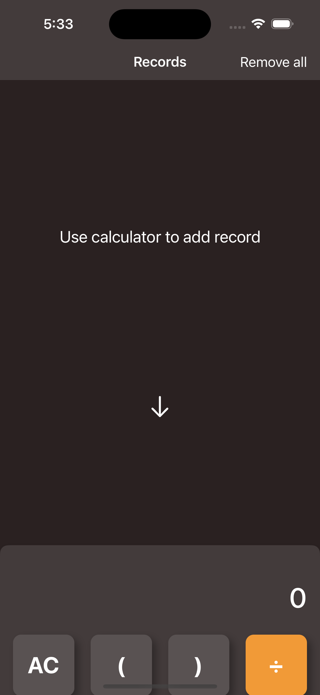
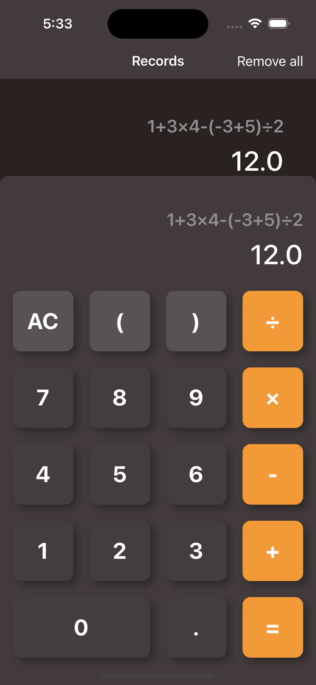
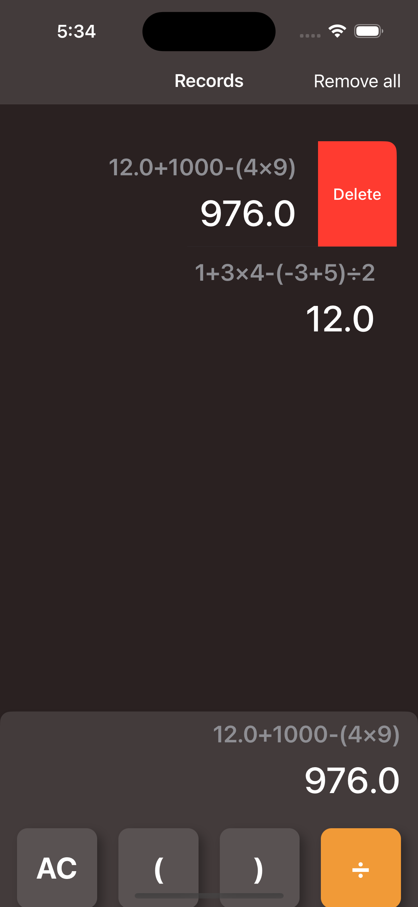

    
    <h1 align="center">Calcuvate</h1>

## About this project
The new app Calcuvate efficiently performs mathematical calculations, and offers a user-friendly interface for easy operation.

## Framework Used
- SwiftUI 📱
- CoreData 💾

## Screenshots

    
    
    
    

